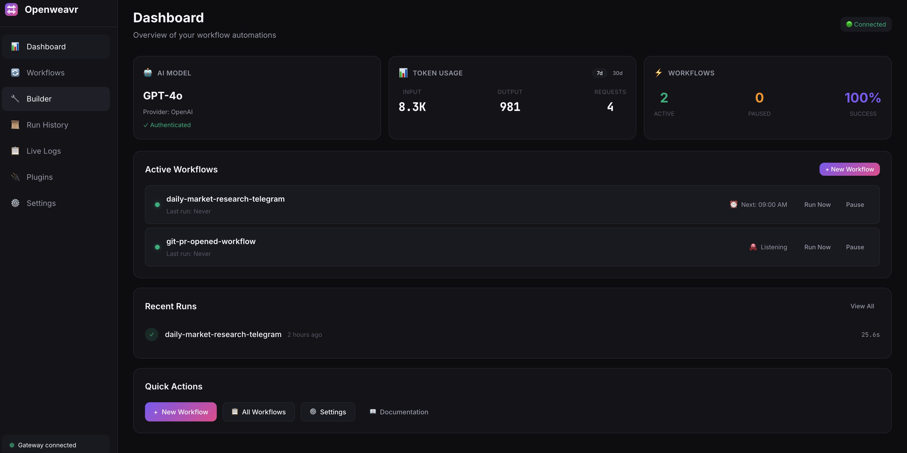

<p align="center">
  
</p>

<p align="center">
  <strong>Self-hosted workflow automation with AI agents.</strong><br/>
  <em>Weave your workflows together.</em>
</p>

<p align="center">
  <a href="https://github.com/openweavr/Openweavr/actions/workflows/ci.yml"></a>
  <a href="https://github.com/openweavr/Openweavr/releases"></a>
  <a href="https://www.npmjs.com/package/@openweavr/weavr"></a>
  <a href="https://opensource.org/licenses/MIT"></a>
  <a href="https://nodejs.org"></a>
</p>

<p align="center">
  
</p>

---

Weavr connects AI agents with your developer tools—GitHub, Linear, Notion, Slack, databases, CI/CD, and more. Think Zapier/n8n, but with native AI agent support and full data sovereignty.

## ✨ Features

- **🏠 Self-hosted** — Your workflows, your data, your infrastructure
- **🤖 AI Agents** — Autonomous agents with web search, file access, shell commands, and multi-step reasoning
- **🔌 Plugin ecosystem** — Built-in integrations for GitHub, Slack, Discord, Telegram, Linear, Notion, and more
- **🧩 MCP Support** — Extend AI agents with any [Model Context Protocol](https://modelcontextprotocol.io/) server
- **📡 Real-time** — WebSocket-powered event streaming
- **🎯 DAG execution** — Parallel steps, conditional logic, retries, error handling
- **🖥️ CLI + Web UI** — Terminal power users and visual builders welcome
- **💬 Messaging** — Built-in WhatsApp, Telegram, Discord, and iMessage support
- **📧 Email & Calendar** — Send emails and manage calendar events

## 🚀 Quick Start

```bash
# Install
npm install -g @openweavr/weavr

# Setup
weavr onboard

# Start the gateway
weavr serve

# Create your first workflow
weavr create
```

## 📖 Example Workflows

### AI Research Agent

```yaml
name: daily-market-research
description: AI agent researches market data and sends a report

trigger:
  type: cron.schedule
  with:
    expression: "0 9 * * *"  # Every day at 9am

steps:
  - id: research
    action: ai.agent
    with:
      tools: "web_search,web_fetch"
      task: |
        Research current market conditions:
        - Gold and silver prices vs USD
        - Top investment opportunities
        - Key financial news from reliable sources
        Compile into an easy-to-read report.

  - id: notify
    action: whatsapp.send
    needs: [research]
    with:
      to: "+1234567890"
      text: "{{ steps.research.result }}"
```

### GitHub to Slack Notifications

```yaml
name: bug-to-slack
description: Notify Slack when GitHub issues are labeled 'bug'

trigger:
  type: github.issue.labeled
  with:
    label: bug

steps:
  - id: notify
    action: slack.post
    with:
      channel: "#bugs"
      message: "🐛 New bug: {{ trigger.issue.title }}\n{{ trigger.issue.html_url }}"
```

See more examples in the [examples/](./examples) directory.

## 🤖 AI Agent Tools

AI agents (`ai.agent` action) can use these built-in tools:

| Tool | Description |
|------|-------------|
| `web_search` | Search the web (requires Brave or Tavily API key) |
| `web_fetch` | Fetch and extract content from URLs |
| `http_request` | Make HTTP/API requests |
| `read_file` | Read file contents |
| `write_file` | Create or modify files |
| `list_directory` | List files in a directory |
| `shell_exec` | Execute shell commands |

Specify tools in your workflow:
```yaml
- id: research
  action: ai.agent
  with:
    tools: "web_search,web_fetch"  # or "all" for all tools
    task: "Research the latest news on AI"
```

You can also extend agents with [MCP servers](https://modelcontextprotocol.io/) for custom tool access.

## 🔌 Built-in Integrations

| Plugin | Actions | Triggers |
|--------|---------|----------|
| **ai** | agent, complete, summarize, classify, sentiment | — |
| **github** | create_issue, comment, get_issue, add_label | push, pull_request, issue, release, etc. |
| **slack** | post, reply | message, reaction |
| **discord** | send, reply | message |
| **telegram** | send, reply | message |
| **whatsapp** | send | — |
| **imessage** | send | — |
| **linear** | create_issue, update_issue | — |
| **notion** | create_page, update_page, query | — |
| **email** | send | — |
| **calendar** | create_event, list_events | — |
| **http** | request, fetch | webhook |
| **cron** | — | schedule |
| **shell** | exec | — |
| **filesystem** | read, write, list | — |

## 🛠️ CLI Commands

```bash
# Setup & Diagnostics
weavr onboard          # Interactive setup wizard
weavr doctor           # Diagnose configuration issues

# Server
weavr serve            # Start gateway server
weavr serve --port 3847

# Workflows
weavr list             # List all workflows
weavr run <name>       # Run a workflow manually
weavr create           # Create new workflow (interactive)

# AI (coming soon)
weavr ask "When PR is merged, deploy to staging"
```

## 🏗️ Architecture

```
┌─────────────────────────────────────────────────────────────┐
│                      Gateway Server                          │
│  ┌─────────────┐  ┌─────────────┐  ┌─────────────────────┐  │
│  │  HTTP API   │  │  WebSocket  │  │  Webhook Receiver   │  │
│  └─────────────┘  └─────────────┘  └─────────────────────┘  │
└─────────────────────────────────────────────────────────────┘
                              │
              ┌───────────────┼───────────────┐
              ▼               ▼               ▼
      ┌─────────────┐ ┌─────────────┐ ┌─────────────┐
      │   Engine    │ │   Plugins   │ │  AI Agent   │
      │ (DAG exec)  │ │  (GitHub,   │ │  (Natural   │
      │             │ │  Slack...)  │ │  language)  │
      └─────────────┘ └─────────────┘ └─────────────┘
```

## ⚙️ Configuration

### AI Provider
Configure your AI provider during onboarding or in Settings:
- **Anthropic** — Claude models (default: `claude-sonnet-4-20250514`)
- **OpenAI** — GPT models (default: `gpt-4o`). Supports OAuth sign-in or API key.
- **Ollama** — Local models (default: `llama3.2`). Any Ollama-supported model works.

You can specify any model your provider supports in `~/.weavr/config.yaml`:
```yaml
provider: anthropic  # or openai, ollama
model: claude-sonnet-4-20250514  # any model ID supported by your provider
```

### Web Search (for AI Agents)
AI agents need a search API to browse the web. Get a free Brave Search API key:

1. Sign up at [brave.com/search/api](https://brave.com/search/api/)
2. Choose "Data for Search" plan (2,000 free queries/month)
3. Add your API key in Settings or set `BRAVE_API_KEY` environment variable

Alternatively, you can use [Tavily Search API](https://tavily.com/) by setting `TAVILY_API_KEY`.

### Environment Variables

| Variable | Description |
|----------|-------------|
| `ANTHROPIC_API_KEY` | Anthropic API key for Claude models |
| `OPENAI_API_KEY` | OpenAI API key for GPT models |
| `BRAVE_API_KEY` | Brave Search API key (for AI agent web search) |
| `TAVILY_API_KEY` | Tavily Search API key (alternative to Brave) |
| `GITHUB_TOKEN` | GitHub personal access token (for GitHub triggers/actions) |
| `SLACK_BOT_TOKEN` | Slack bot token (for Slack integration) |
| `DISCORD_BOT_TOKEN` | Discord bot token (for Discord integration) |
| `TELEGRAM_BOT_TOKEN` | Telegram bot token (for Telegram integration) |
| `LINEAR_API_KEY` | Linear API key (for Linear integration) |

## 📁 Project Structure

```
~/.weavr/
├── config.yaml        # Global configuration
├── workflows/         # Your workflow definitions
├── plugins/           # Installed plugins
├── logs/              # Execution logs
└── scheduler.db       # Scheduler queue/state (configurable)
```

You can override the scheduler database location in `~/.weavr/config.yaml`:

```yaml
scheduler:
  dbPath: /path/to/scheduler.db
```

## 🔌 Creating Plugins

```typescript
import { definePlugin, defineAction } from 'weavr/plugins';

export default definePlugin({
  name: 'my-plugin',
  version: '1.0.0',

  actions: [
    defineAction({
      name: 'greet',
      execute: async (ctx) => {
        const name = ctx.config.name as string;
        ctx.log(`Hello, ${name}!`);
        return { greeted: name };
      },
    }),
  ],
});
```

## 📚 Documentation

Full documentation is available at [openweavr.github.io/Openweavr](https://openweavr.github.io/Openweavr/).

- [Getting Started](https://openweavr.github.io/Openweavr/getting-started.html)
- [Writing Workflows](https://openweavr.github.io/Openweavr/workflows.html)
- [AI Agents](https://openweavr.github.io/Openweavr/agents.html)
- [Integrations](https://openweavr.github.io/Openweavr/integrations.html)
- [CLI Reference](https://openweavr.github.io/Openweavr/cli.html)

## 🤝 Contributing

We welcome contributions! AI-assisted PRs are explicitly encouraged.

See [CONTRIBUTING.md](.github/CONTRIBUTING.md) for guidelines.

## 📜 License

MIT © Weavr Contributors
